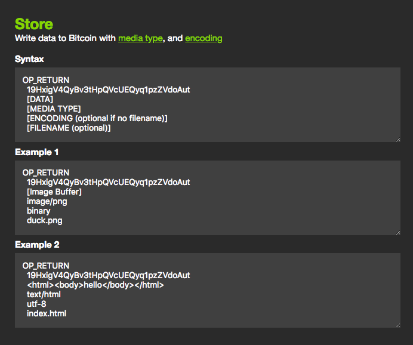
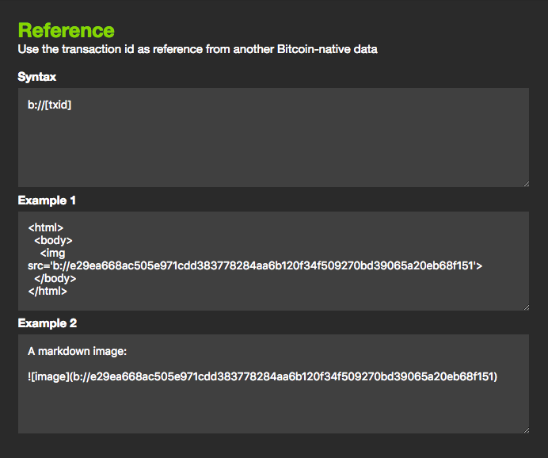

# B://

> Bitcoin Data Protocol

Store and reference data on the Bitcoin blockchain.





<br>

# Intro

B is an OP_RETURN protocol to **store** and **reference** arbitrary data on Bitcoin.

The design goal:

1. The simplest protocol to upload arbitrary media to the blockchain
2. A protocol to **reference** previously uploaded media from another **on-chain media**.

<br>

# Protocol

- The prefix for B is [19HxigV4QyBv3tHpQVcUEQyq1pzZVdoAut](https://babel.bitdb.network/query/1DHDifPvtPgKFPZMRSxmVHhiPvFmxZwbfh/ewogICJ2IjogMywKICAicSI6IHsKICAgICJmaW5kIjogewogICAgICAib3V0LnMxIjogIjE5SHhpZ1Y0UXlCdjN0SHBRVmNVRVF5cTFwelpWZG9BdXQiCiAgICB9LAogICAgInByb2plY3QiOiB7CiAgICAgICJvdXQubHMyIjogMCwgIm91dC5saDIiOiAwLCAib3V0LmkiOiAwLCAib3V0LmIxIjogMCwgIm91dC5iMyI6IDAsICJvdXQuaDEiOiAwLCAib3V0LmgzIjogMAogICAgfSwKICAgICJsaW1pdCI6IDEwCiAgfSwKICAiciI6IHsKICAgICJmIjogIlsuW10gfCB7IHRyYW5zYWN0aW9uOiAudHguaCwgYmxvY2s6IC5ibGssIHB1c2hkYXRhOiB7IGIwOiBcIk9QX1JFVFVSTlwiLCBzMTogLm91dFswXS5zMSwgbGIyOiAub3V0WzBdLmxiMiwgczM6IC5vdXRbMF0uczMgfSB9XSIKICB9Cn0=), generated using [Bitcom](https://bitcom.bitdb.network)

Here's an example of what **POST transactions** look like:

```
OP_RETURN
  19HxigV4QyBv3tHpQVcUEQyq1pzZVdoAut
  [Data]
  [Media Type]
  [Encoding]
  [Filename]
```

The order is deliberately `data`, `media type`, and `encoding`, `filename`, in the order of significance (With future extensibility through adding additional push data).


1. **Data:** data to store
2. **Media Type:** As listed at https://www.iana.org/assignments/media-types/media-types.xhtml
3. **Encoding:** As listed at https://www.iana.org/assignments/character-sets/character-sets.xhtml (The default is `binary`)
4. **Filename:** a filename to store the blob as (the default has no filename and just stored as a blob, identified simply by the txid)

Example: HTML

```
OP_RETURN 19HxigV4QyBv3tHpQVcUEQyq1pzZVdoAut  <html><body>hello world</body></html>  text/html  UTF-8  hello.html
```

<br>

# Note

**B://** is NOT a protocol for handling authenticated and encrypted media (That would be a much more complex problem). The main design goal of B is:

1. **Public:** Public assets
2. **Simple:** Simple to implement
3. **Versatile:** Easily pluggable to any application in any context
4. **Extensible:** Future extensibility with additional push data support

<br>

# Demo

Try it here: https://b.bitdb.network

<br>

# Usage

## 1. Uploading Large Media

Let's upload an image. 

You can try it [here](https://b.bitdb.network) (up to 100KB)

When you select a file, it **directly writes the binary (ArrayBuffer)** into Bitcoin pushdata (instead of base64 string). The resulting OP_RETURN would look something like this:

```
OP_RETURN 19HxigV4QyBv3tHpQVcUEQyq1pzZVdoAut [ArrayBuffer from the file]  image/png  binary  duck.png
```

By default, the encoding is `binary`, so you could just do (if you don't care about file names):

```
OP_RETURN 19HxigV4QyBv3tHpQVcUEQyq1pzZVdoAut [ArrayBuffer from the file]  image/png
```

Another example:

```
OP_RETURN 19HxigV4QyBv3tHpQVcUEQyq1pzZVdoAut [ArrayBuffer from the file]  text/html  UTF-8  index.html
```

<br>

## 2. Referencing Media

Once uploaded, this media can be referenced from ANY other transactions using a transaction hash. For example, let's say the media hash for an image uploaded this way was `46e1ca555622e73708a065f92df0af2cc0fe00ed1dd352d5fb8510365050347c`.

You can reference it in another HTML file like this:

```
<html>
<body>

</body>
</html>
```

Of course, to upload this HTML file itself, you would do this:

```
OP_RETURN
19HxigV4QyBv3tHpQVcUEQyq1pzZVdoAut
<html><body></body></html>
text/html
UTF-8 
example.html
```

Once this HTML file is uploaded to Bitcoin, and the tx hash is `e2be88f33d98074f778ddd94c13fe500cb1f5a4dfb3ed958391c95f431c20549`, you can link it from another HTML, like this:


```
<html>
<body>
Check out <a href="b://e2be88f33d98074f778ddd94c13fe500cb1f5a4dfb3ed958391c95f431c20549">my website!</a>
</body>
</html>
```

You can use it in a markdown too:

```
[Here](b://e2be88f33d98074f778ddd94c13fe500cb1f5a4dfb3ed958391c95f431c20549) is a website, which contains the following image:


```

Of course, you will upload it like this:

```
OP_RETURN
19HxigV4QyBv3tHpQVcUEQyq1pzZVdoAut
[Here](b://e2be88f33d98074f778ddd94c13fe500cb1f5a4dfb3ed958391c95f431c20549) is a website, which contains the following image:\n
text/markdown
UTF-8 
README.md
```

